# 
Fuad Hiybo Hussin

<h3 align="center">🚀 Full-Stack Software Developer (Frontend & Backend)</h3>

  

    📍 <strong>Malaysia</strong> &nbsp;•&nbsp; 
    ✉️ <strong>fuadhiyabo@gmail.com</strong> &nbsp;•&nbsp; 
    💬 <strong>+249 63737568 (WhatsApp)</strong> &nbsp;•&nbsp; 
    📞 <strong>+60 17-935 9120 (Calls)</strong>
  

  

    🔗 <a href="https://linkedin.com/in/fuad-hiyabo">LinkedIn Profile</a> &nbsp;•&nbsp;
    🔗 <a href="https://github.com/fuad665">GitHub Portfolio</a> &nbsp;•&nbsp;
    💼 
  

 

  <!-- Animated Profile Banner -->
  

 

<h2 align="center">👤 Executive Summary</h2>

  <table width="85%">
    <tr>
      <td>
        

          I am a highly skilled <strong>Full-Stack Software Developer</strong> with comprehensive, end-to-end expertise across both <strong>Frontend</strong> and <strong>Backend</strong> architectures. I specialize in building complete, high-performance web applications—combining interactive, responsive user interfaces with secure, scalable database structures and server-side systems. Leveraging technologies like <strong>Next.js (App Router)</strong>, <strong>React</strong>, and <strong>Node.js</strong> alongside <strong>Supabase</strong> and <strong>PostgreSQL</strong>, I take absolute ownership of full-stack engineering cycles, from database schema design and Row-Level Security (RLS) policies to cloud deployment and optimization.
        

      </td>
    </tr>
  </table>

 

---

<h2 align="center">⚡ Core Engineering Specializations</h2>

  <table width="90%">
    <tr>
      <td width="50%" valign="top">
        <h3 align="center">🎨 Frontend Architecture &amp; UI</h3>
        

          Crafting responsive, high-performance user interfaces and interactive visual experiences.
        

        <ul>
          <li><strong>Frameworks &amp; Libraries:</strong> Next.js (App Router), React.js</li>
          <li><strong>Styling &amp; UX:</strong> Tailwind CSS v4, Responsive Layouts, Fluid Animations</li>
          <li><strong>State &amp; Integration:</strong> Context API, React Hooks, Axios Client, Interceptors</li>
          <li><strong>Asset Rendering:</strong> Canvas-based PDF exports, dynamic SVG badges, QR Code generation</li>
        </ul>
      </td>
      <td width="50%" valign="top">
        <h3 align="center">⚙️ Backend Systems &amp; Databases</h3>
        

          Engineering scalable server logic, secure databases, and reliable API services.
        

        <ul>
          <li><strong>Runtime &amp; API:</strong> Node.js, Express.js, RESTful API design</li>
          <li><strong>Database Management:</strong> PostgreSQL, complex relational schemas, SQL optimization</li>
          <li><strong>Backend-as-a-Service:</strong> Supabase (Auth, RLS Security Policies, Database Triggers)</li>
          <li><strong>CI/CD &amp; Tools:</strong> Git, GitHub Actions workflows, Vercel deployments</li>
        </ul>
      </td>
    </tr>
  </table>

 

---

<h2 align="center">🛠️ Technical Tech Stack</h2>

  <!-- Soft, Uniform Slate-Themed Badges to maintain a clean, uncluttered visual aesthetic -->
  
  
  
  
  
  
   
  
  
  
  
  
   
  
  
  
  
  

 

---

<h2 align="center">📁 Featured Engineering Projects</h2>

 

  <table width="90%" border="0">
    <!-- Project 1: MemberFlow -->
    <tr>
      <td>
        <h3>🪪 <a href="https://github.com/fuad665/Membership-Management-System">MemberFlow: SaaS Membership System</a></h3>
        

          A production-grade, full-stack SaaS dashboard engineered for organizations to manage departmental hierarchies and issue digital credentials. Integrates a responsive user interface with complete database tables and triggers, secured by Row-Level Security (RLS) policies and authentication.
        

        

          <code>Next.js 16 (App Router)</code> &nbsp;•&nbsp; <code>Tailwind CSS v4</code> &nbsp;•&nbsp; <code>Supabase</code> &nbsp;•&nbsp; <code>PostgreSQL</code>
        

        

          🔗 <a href="https://github.com/fuad665/Membership-Management-System">GitHub Repository</a> &nbsp;|&nbsp; 🔗 <a href="https://membership-management-system-rho.vercel.app/">Live Deployment</a>
        

      </td>
    </tr>
    <!-- Spacing -->
    <tr><td> 
 </td></tr>
    <!-- Project 2: Market Analytics -->
    <tr>
      <td>
        <h3>📈 <a href="https://github.com/fuad665/market-analytics">AI Market Trend Prediction Analytics</a></h3>
        

          An analytical forecasting platform modeling price movements and indices. Uses an optimized data processing backend to parse market data and renders interactive charts on the frontend client.
        

        

          <code>Python</code> &nbsp;•&nbsp; <code>FastAPI</code> &nbsp;•&nbsp; <code>Pandas</code> &nbsp;•&nbsp; <code>React.js</code> &nbsp;•&nbsp; <code>Chart.js</code>
        

        

          🔗 <a href="https://github.com/fuad665/market-analytics">GitHub Repository</a>
        

      </td>
    </tr>
  </table>

 

---

<h2 align="center">📊 Activity Analytics</h2>

 

  <table border="0" cellpadding="0" cellspacing="0" width="85%">
    <tr align="center">
      <td>
        <!-- GitHub Stats Card -->
        
      </td>
      <td>
        <!-- Top Languages Card -->
        
      </td>
    </tr>
  </table>

   

  <!-- Streak Stats Card -->
  

 

---

<h2 align="center">🐍 Contribution Art</h2>

 

  <!-- Animated Contribution Snake -->
  <picture>
    <source media="(prefers-color-scheme: dark)" srcset="https://raw.githubusercontent.com/fuad665/fuad665/output/github-contribution-grid-snake-dark.svg" />
    <source media="(prefers-color-scheme: light)" srcset="https://raw.githubusercontent.com/fuad665/fuad665/output/github-contribution-grid-snake.svg" />
    
  </picture>

 

---

  
<em>“Striving to write code that makes data make sense.”</em>

